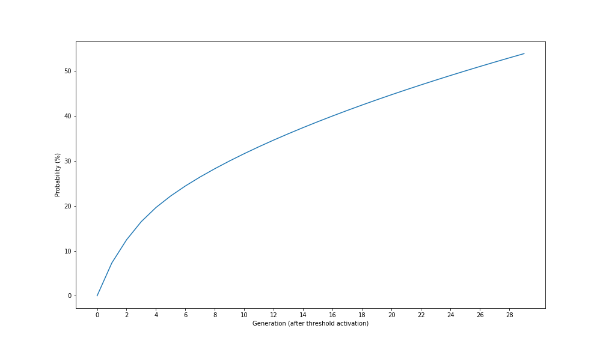

## EQUAL RUNS RESULT
The following plot is showing the results obtained by 11 runs.



Some example of best individuals are reported below.

```c++
segmentsAcked = (int) (-66.58*(-73.836));
TcpLinuxCongestionAvoidance (tcb, segmentsAcked);
segmentsAcked = SlowStart (tcb, segmentsAcked);
segmentsAcked = SlowStart (tcb, segmentsAcked);
ReduceCwnd (tcb);
ReduceCwnd (tcb);
ReduceCwnd (tcb);
```

```c++
if (segmentsAcked < segmentsAcked) {
	segmentsAcked = (int) (2.61+(segmentsAcked)+(66.799)+(5.694));

} else {
	segmentsAcked = (int) (tcb->m_segmentSize-(91.815)-(segmentsAcked)-(84.158)-(38.651));
	TcpLinuxCongestionAvoidance (tcb, segmentsAcked);
	TcpLinuxCongestionAvoidance (tcb, segmentsAcked);

}
TcpLinuxCongestionAvoidance (tcb, segmentsAcked);
ReduceCwnd (tcb);
if (tcb->m_cWnd < tcb->m_segmentSize) {
	tcb->m_cWnd = (int) (0.1/8.71);
	TcpLinuxCongestionAvoidance (tcb, segmentsAcked);
	segmentsAcked = SlowStart (tcb, segmentsAcked);

} else {
	tcb->m_cWnd = (int) (6.934+(48.812));

}
CongestionAvoidance (tcb, segmentsAcked);
```