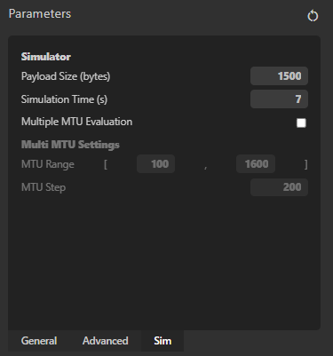
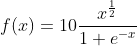

# REPORT

After the first positive results, a more in depth analysis has been performed. Multiple problems were found in the fitness evaluation process, and solved. NS3 still crash sometimes, I guess the reason is memory related, and not dependent from the python code. A new GUI tool has been created to be able to better explore different hyperparameters combinations.  

## Intro
Library was not yet readady and runs with a big number of generations were prone to crash. Most of the time was caused by *ns3* not able to compile due to not valid code.  

## Install the tool in a linux machine (or WLS1, tested)
Download the ns3 zip from: 

https://drive.google.com/file/d/1fXZM_KcW6sxfGTa1mEPPZ4yohFNRb8Om/view?usp=sharing

It contains an edited version of ns3 already configured to work with pyGENP; keep track of the main folder path, you need to set it in the **.env** file to tell pyGENP where the simulator is located.

Clone the repository, configure the **.env** file with the correct path and the number of available cpus.

```bash
git clone <repo> 
cd <repo>
python3 -m venv venv
source venv/bin/activate
pip install --upgrade pip
pip install -r requirements.txt
python server.py
```

A Docker ready image is a Work In Progress Task.

## GENP the pyGENP tool

It was difficult to manage multiple runs by command line to the point that a tool was required to better change hyperparameters and visualize metrics.
The tool is implementing some core feauture:

1. `Hyperparameters Managment`: hyperparameters can be changed quickly, saved for later use and imported;
2. `Memory Clean`: utility to kill a run (all the spawned threads), clean the folders and reset the ns3;
3. `NS3 baseline`: launch it to get the baseline, it will be prefetched in a file `baseline` in main folder;
4. `NS3 clean`: launch it to run **./waf configure** and kill the `wifi-tcp` processes that could still running (an issue that i was not able to solve);
5. `Autofix`: if everything seems stuck this utility tries to autofix the configuration;
6. `Take Snapshot`: a snapshot of the current state of the application is *taken*. A .zip file containing multiple files (cpp code, pickels of individuals, configuration hyperparameters, hall_of_fame, current generation fitnesses, out buffer and out error buffer) is generated;
7. `Restore Snapshot`: you are able to import a snapshot to visualize the graph of the hall of fame fitness, or to start a new run by the snapshot.

Having snapshots could be very useful to try out different hyperparameters from an already evolved group of individuals. You can also specify a greater number of individuals from the ones imported.

After running from the main <repo> folder:

```
python server.py
```

go to: http://localhost:5000/ to use the tool.

### Tool


### HyperParameters




## THE STAGNATION PROBLEM
One of the problems that I have noticed the most is the stagnation of the population after some improvements.
I tried to implement a modified version of the technique described in this paper: https://www.mdpi.com/2076-3417/11/8/3461/htm at page 5. It is called `Stagnation Driven Extinction Protocol`; in particular the `Targeted Extinction` one.

If generations are stagnant for `sdep_k` generations individuals are extincted with probability:

`probability = (sdep_p+sdep_f(sdep_current_stagnation-sdep_k))`

where `sdep_f` is defined as:



The reason of the choice is because it grows less than an exponential function in the long run, but more than a logaritmic one.

Another requirement to be considered for extinction is that their fitness must be under a threshold calculated as:

`elite_fitness*(1-sdep_t)`

The Elite individual is not affected by this process; the number of extincted individuals are replaced by fresh generated code, and not by crossover, in order to explore more the space of the solutions and exit from an hypotetical local minima.

## RUNS
A collection of the runs, and bug found.

Before SDEP (the first one is reporting a bug that is solved):


After implementing the SDEP technique:


The best result:


## CONCLUSION
By injecting code into the TCPNewReno from the TCPLinux algorithm, it was possible, with a payload size of 1500 bytes to improve the throughput of a point to point connection over WiFi by **4.95%**, or from **52.64 Mbit/s** to **55.25 Mbit/s**.
Multiple runs have lead to this best solution; by removing the "knowledge" of these to 2 algorithms no runs was able to improve the current TCPNewReno.

## Notes
You can find the baseline simulation results in this folder as `baseline.md`.
For snapshots of the reported graphs take a look at `./RUNS` folder.


 


